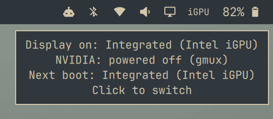

# Omarchy on the 2013 MacBook Pro (MacBookPro10,1): GPU switching that actually works

Boot the 15" Retina MacBook Pro (early/mid 2013, Intel HD 4000 + NVIDIA GeForce GT 650M) on the
**Intel GPU**, keep the choice across reboots, and **power the idle NVIDIA card off** so it
stops burning battery. Includes an Omarchy bar widget that shows which GPU is driving the
display and lets you switch with a click.

Tested on: MacBookPro10,1, Boot ROM 429.0.0.0.0, Omarchy 4.0.2, Linux 7.1.9, Hyprland 0.56,
Quickshell 0.3.1, Limine, LUKS + btrfs, hibernate enabled. Verified on 2026-09-04.

The same mechanism should apply to other dual-GPU Macs with Apple gmux (2011 to 2014 15" MacBook
Pros). The 2014 MacBookPro11,3 and 11,5 additionally need `apple_set_os`; this one does not.

## Why this exists

Apple's firmware decides at power-on which GPU owns the built-in panel, and by default it picks
the NVIDIA card. On Linux that means:

- the nouveau driver runs the display, with weaker performance and quirks (invisible cursor, etc.);
- the Intel GPU sits unused;
- the NVIDIA card is fully powered even when you switch to Intel, because nouveau has no runtime
  power management on Macs.

The usual Linux tools (supergfxd, `omarchy toggle hybrid-gpu`, envycontrol, prime-style
offloading) cannot see through gmux and do nothing here. The only lever is the NVRAM variable
`gpu-power-prefs`, and it has two undocumented quirks that make naive solutions silently stop
working after one reboot. Details in [docs/how-it-works.md](docs/how-it-works.md).

## What you get

| Piece | Where it lands | Purpose |
|---|---|---|
| `omarchy-gpu-switch-apply` | `/usr/local/lib/` | Root helper. Writes `gpu-power-prefs` for the next boot and powers the idle dGPU off through gmux. |
| `omarchy-gpu-switch-persist.service` | `/etc/systemd/system/` | Runs the helper on every boot, before the display manager. |
| sleep hook | `/usr/lib/systemd/system-sleep/` | Runs the helper again after hibernate resume. |
| `/etc/omarchy-gpu-mode` | | `integrated` or `dedicated`. The source of truth for the next boot. |
| `/etc/omarchy-gpu-dgpu-power` | | `auto` (power the NVIDIA card off when idle) or `on`. |
| `omarchy-gpu-switch` | `~/.local/bin/` | Your command: status, switch, dGPU power. |
| `rial.gpu-status` | `~/.config/omarchy/plugins/` | Bar widget: `iGPU` / `dGPU`, highlighted when a switch is pending. |

The widget in the top bar, and what its tooltip shows on hover:

<p>
  
  <br>
  
</p>

## Install, step by step

1. Install Omarchy normally. The stock kernel already has everything needed (`i915`, `nouveau`,
   `apple_gmux`, `vga_switcheroo`). No extra packages.

2. Open a terminal and clone this repo:

   ```bash
   git clone https://github.com/RIAL0/OmarchyMacbookPro2013.git
   cd OmarchyMacbookPro2013
   ```

3. Run the installer as your normal user. It calls `sudo` for the system part and needs a real
   terminal for the password prompt:

   ```bash
   ./install.sh
   ```

   It seeds `/etc/omarchy-gpu-mode` from whatever GPU is driving the panel right now (on a fresh
   install that is `dedicated`), so nothing changes until you ask for it.

4. Choose the Intel GPU for the next boot and reboot:

   ```bash
   omarchy-gpu-switch integrated
   ```

   It asks whether to reboot now. Say yes, or reboot whenever you like.

5. After the reboot, verify:

   ```bash
   omarchy-gpu-switch status
   ```

   Expected:

   ```
   Display currently driven by : Integrated (Intel iGPU)
   GPU selected for next boot  : Integrated (Intel iGPU)
   NVIDIA dGPU power           : powered off (gmux)
   ```

   And in the kernel log, `journalctl -b -k | grep -E 'fbcon|switcheroo'` shows
   `fbcon: i915drmfb (fb0) is primary device` and `VGA switcheroo: switched nouveau off`.

That is it. Every later boot re-applies the choice automatically.

## Daily use

```
omarchy-gpu-switch                 interactive: show state, offer to switch and reboot
omarchy-gpu-switch status          show current and next-boot GPU, NVIDIA power state
omarchy-gpu-switch integrated      boot on the Intel GPU next time
omarchy-gpu-switch dedicated       boot on the NVIDIA GPU next time
omarchy-gpu-switch dgpu on         keep the NVIDIA card powered while idle
omarchy-gpu-switch dgpu off        power it off while idle (default)
```

Add `--no-reboot` to skip the reboot prompt. The bar widget calls the same script: left-click
opens the interactive switcher in a floating terminal, right-click refreshes.

**External displays.** HDMI and the two Thunderbolt/DisplayPort ports are wired to the NVIDIA
card only. With the card powered off they are dead. Run `omarchy-gpu-switch dgpu on` before
plugging in, and `dgpu off` again afterwards, or the card stays powered on every boot.
Driving an external display from the Intel side has not been tested on this setup.

**Suspend and hibernate.** Plain suspend needs nothing; gmux restores the powered-off state
itself. Hibernate goes through the firmware like a cold boot, which powers the card back on and
consumes the NVRAM variable; the sleep hook re-applies both on resume.

## If something goes wrong

- **Black screen after a reboot.** Hold `Cmd + Option + P + R` at power-on until you hear the
  chime twice. That resets NVRAM, clears `gpu-power-prefs`, and the firmware falls back to the
  NVIDIA card. Then fix whatever went wrong and switch again.
- **Desktop does not come up with the NVIDIA card powered off.** Press `Ctrl + Alt + F3`, log
  in, run `sudo /usr/local/lib/omarchy-gpu-switch-apply dgpu on`, reboot.
- **`od: Invalid argument` when reading the NVRAM variable.** Normal. See the second quirk in
  [docs/how-it-works.md](docs/how-it-works.md). Trust `omarchy-gpu-switch status`, not the raw
  variable.

More in [docs/troubleshooting.md](docs/troubleshooting.md).

## Removing it

```bash
./uninstall.sh
```

Removes all files, the service, the widget and its `shell.json` entry, and powers the NVIDIA card
back on. The next boot after that still honours whatever `gpu-power-prefs` holds; the one after
returns to the firmware default (NVIDIA).

## Repository layout

```
install.sh / uninstall.sh
system/    omarchy-gpu-switch-apply, the systemd unit, the sleep hook
user/      omarchy-gpu-switch CLI, the bar widget plugin
docs/      how-it-works.md, troubleshooting.md, macbookpro10-1-notes.md
extras/    diag.sh, a root-level NVRAM diagnostic used while figuring this out
```

## Other things worth knowing on this laptop

Wi-Fi, keyboard function keys, the harmless kernel warnings at boot, battery figures before and
after: [docs/macbookpro10-1-notes.md](docs/macbookpro10-1-notes.md).

## Credits and license

Built and verified on a MacBookPro10,1 running Omarchy in September 2026, with Claude Code doing
the digging. The NVRAM mechanism is the one used by [0xbb/gpu-switch](https://github.com/0xbb/gpu-switch);
the one-shot and unreadable-after-consumption behaviour of the variable, and the gmux power-off
through vga_switcheroo on top of it, were worked out here.

MIT, see [LICENSE](LICENSE).
